# Processor 1

---

### Instruction Execution

- PC → pointing instruction memory, fetch instruction
- Register numbers → register file, read registers
- Depending on instruction
**Use ALU** → arithmetic, Memory load/store, Branch
**Access memory** → Load/Store
**PC** → read PC + 4(next instruction, after 4 byte)/target addr

### Functional units (basic datapath elements)

- **Combinational element**
Function (Same input, Same output)
AND-gate, Adder, Multiplexer, Arithmetic/Logic Unit
- **State (sequential) elements**
Store data/state

### Flip-Flop = Save State

Unless do something to C and D, the state keep exported to Q (saved at S-R latch)
→ **Save 1 bit, 32 flipflop = register**

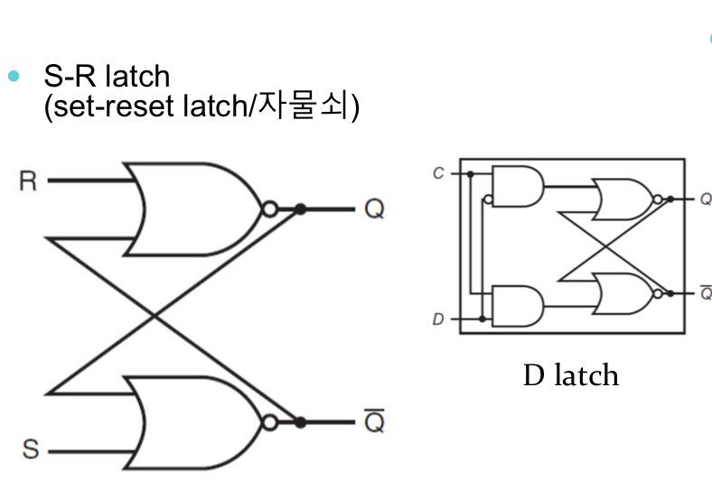

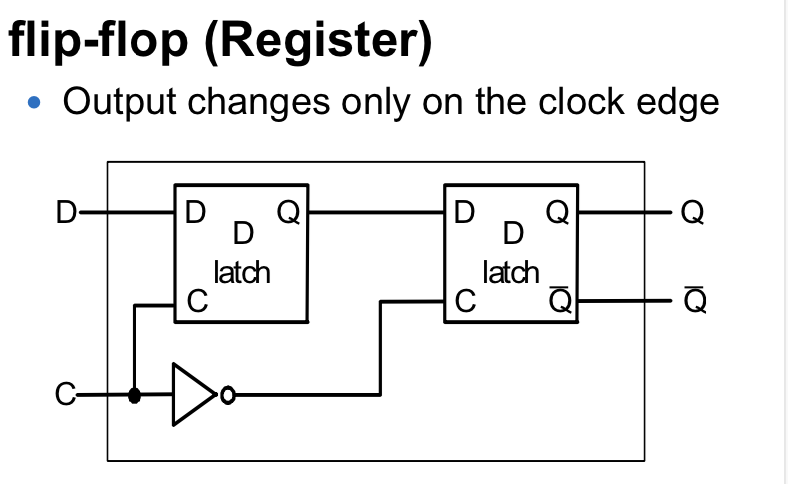

### Sequential Elements

- State changed at clock rising edge **Edge-triggered**

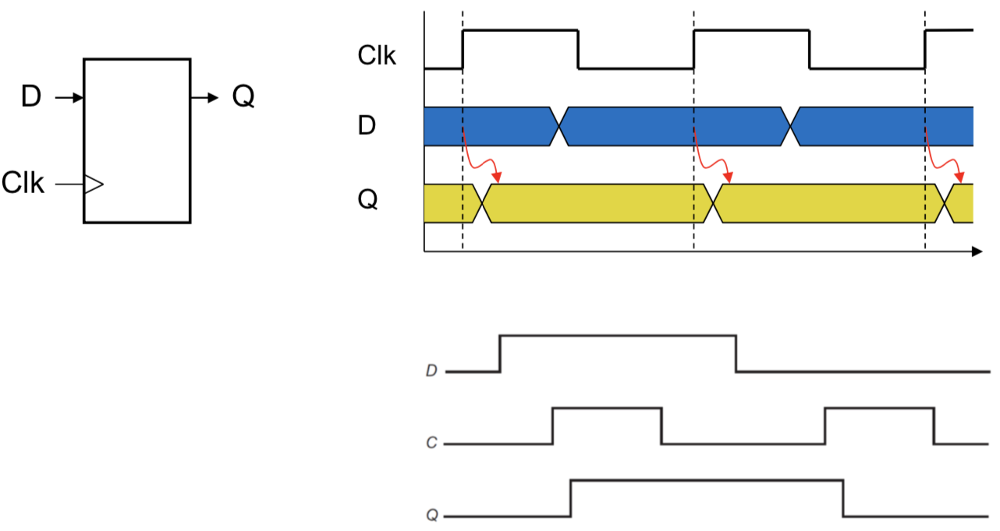

### Clocking Methodology

**Edge triggered methodology**

- Base on current state, change state at Action
- State change at every **clock** by **Instruction**

 Clock cycle → based on **longest instruction delay**

input = current state, output = updated state

## Register file

---

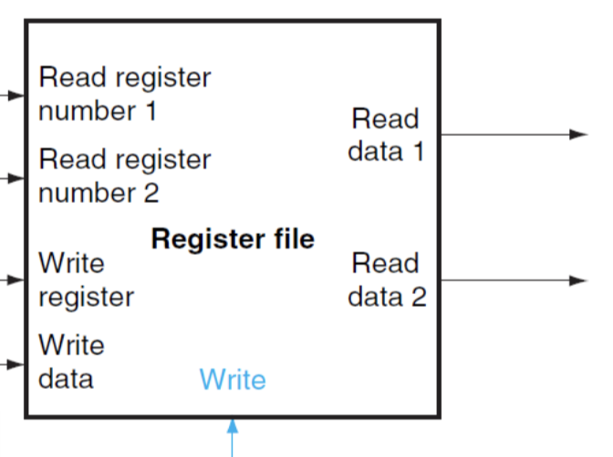

Set of registers can be R, W 

Using flip-flops

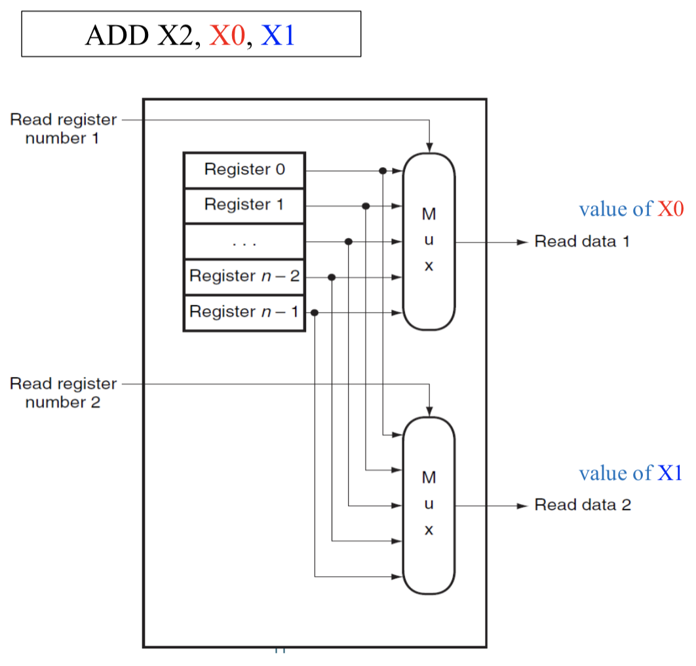

**Register Read**

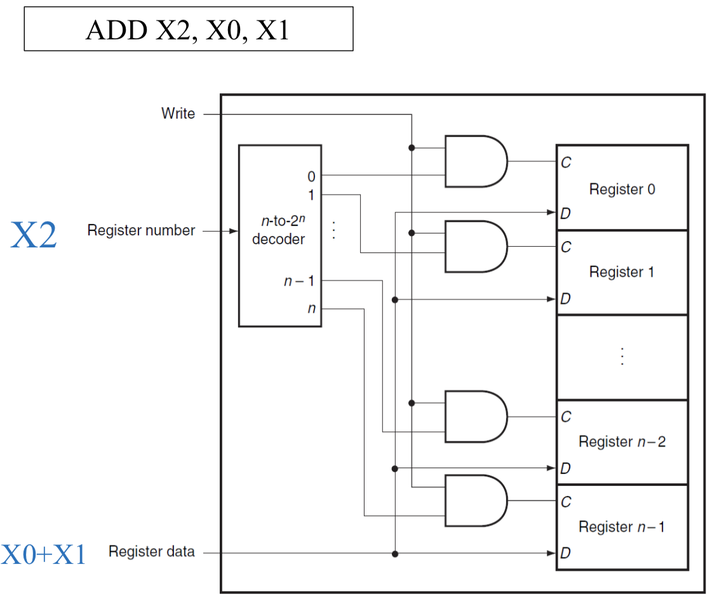

**Register Write**

## Building a Datapath

---

Single Cycle Implementation → one Instruction per clock(cycle)

**Instruction Fetch**

Process of getting instruction in memory (4byte-32bit instruction)

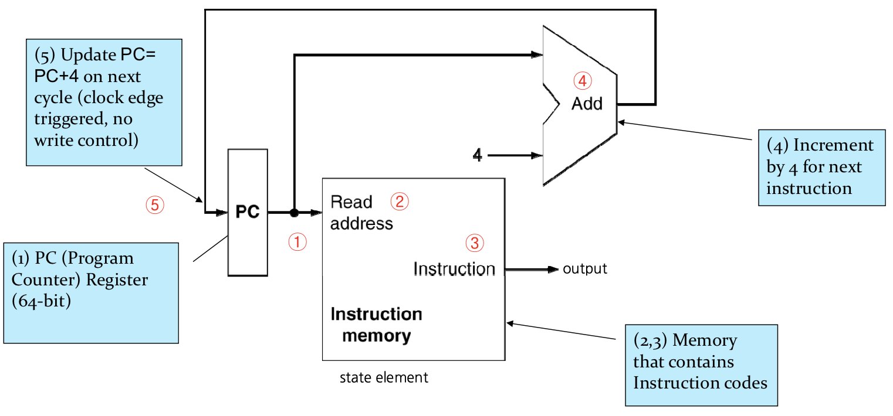

**Fetch Components**

Required operations

- Take addr from PC, read Instruction from memory
- Increment PC

Components

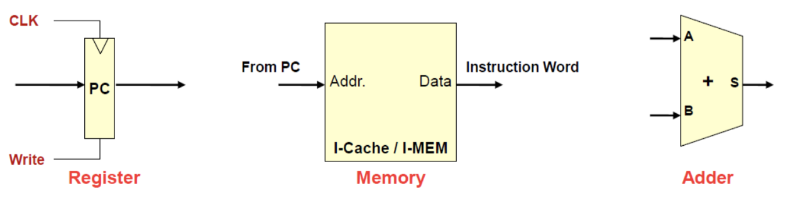

**R-Format Instructions**

- Read 2 register operands
- Arithmetic/logical operation
- Write register result

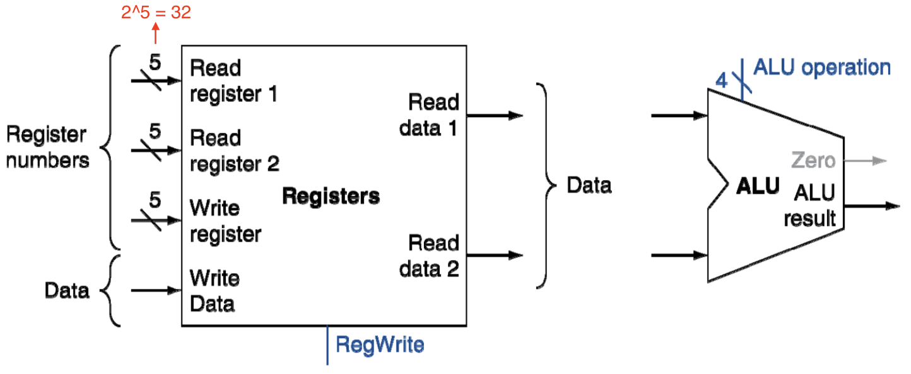

**Datapath for R-type Instruction**

Read 2 reg + ALU operation + Write 1 reg

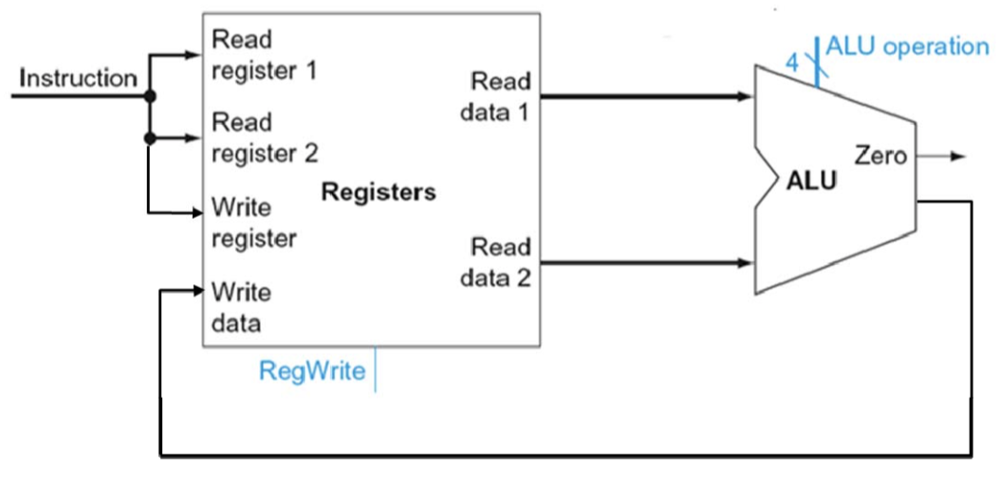

## **Load/Store Instructions**

---

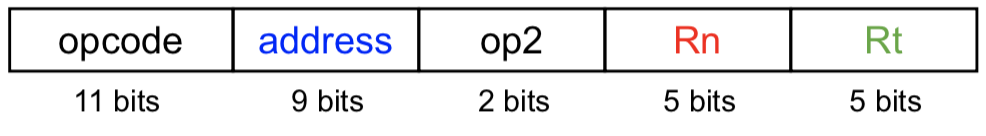

> LDUR X1, [ X2, offset_value]  
STUR X1, [ X2, offset_value] 

→ Load (X2 + offset_value) and Store X1

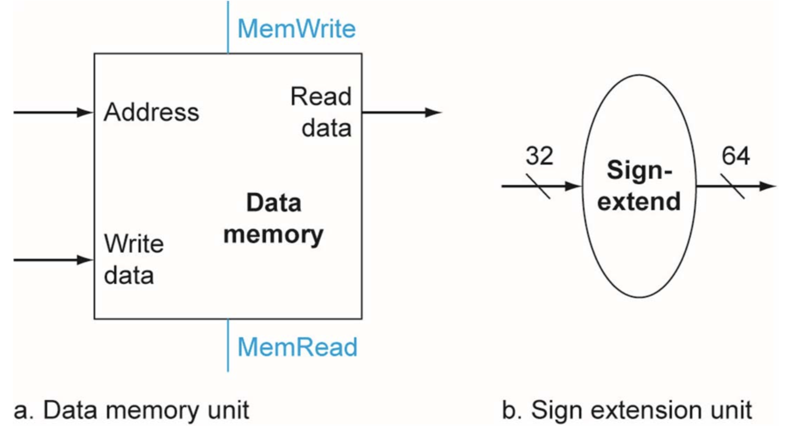

- Use ALU → need for **adding** offset + memory **reference** & reg
- but **sign-extend the 9-bit** offset field to a **64-bit signed** value (put 0 at front)

**Datapath for a Load or Store Instruction**

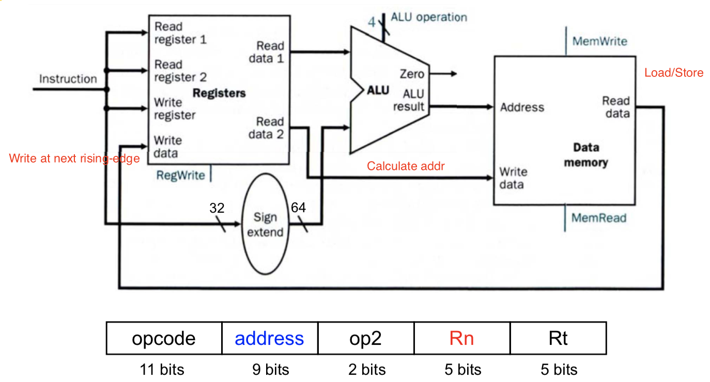

**Datapath for a Load or Store Instruction or R-type Instruction**

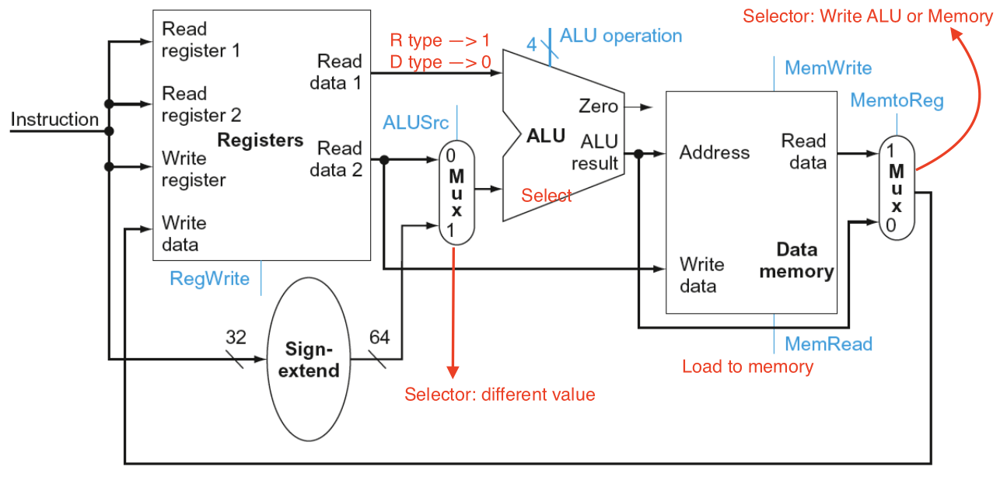

**R-Type /D‐Type instruction Datapath**

Input, Output, values

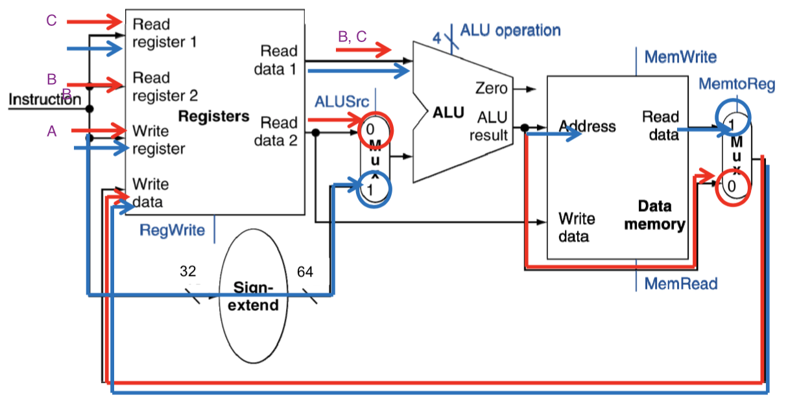

## Branch Instructions

---

→ Change location of next instruction

> CBZ X1, offset (or B.EQ or CMP X1, X2, label)

- Compare (user ALU, sub and check 0)
- Calculate target addr (next PC addr)
Sign-extend displacement → **Shift left 2 places** → PC + 4

 Comparing 2 reg → all B.EQ

**Datapath segment for branches**

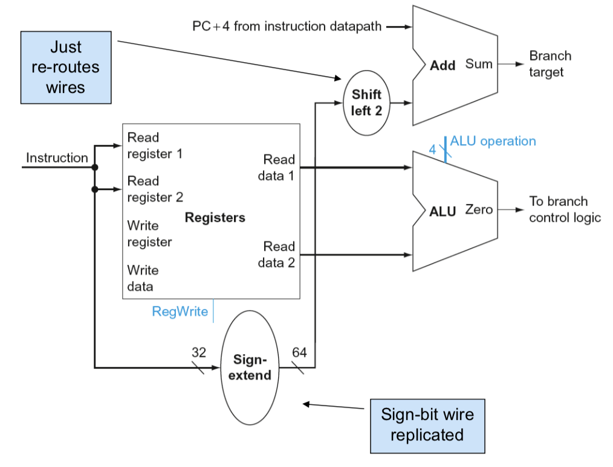

**Branch Instructions**

CBZ X1, offset (using 1 reg)

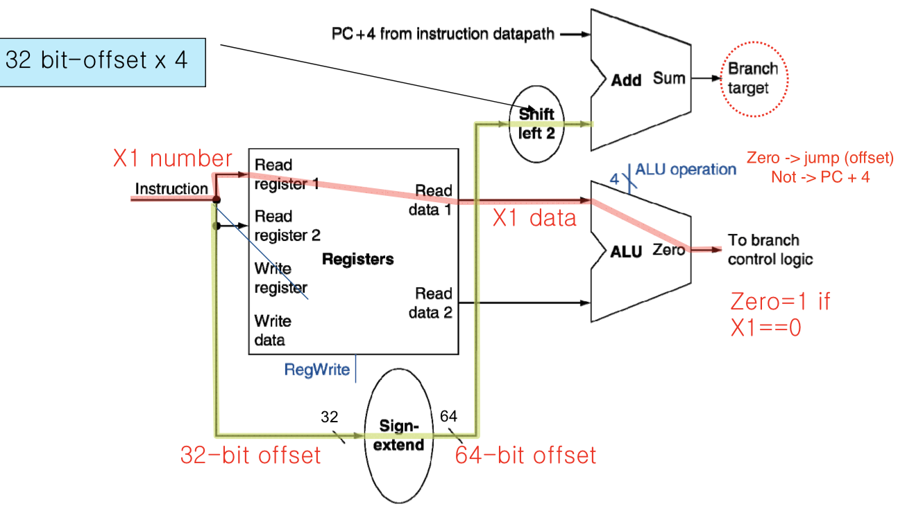

B.EQ X1, X2, offset (CMP X1, X2, offset)

## Composing Elements

---

Simplest datapath → all instructions **in one clock cycle**

**Full Datapath: Arithmetic+Memory+Branch**

Time passing datapath differs by instruction 

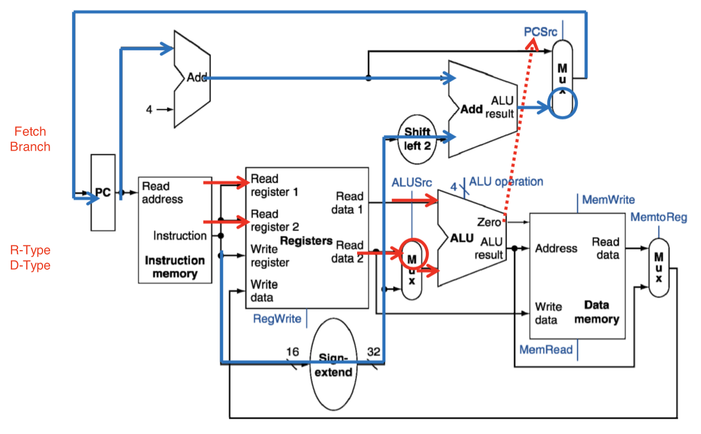