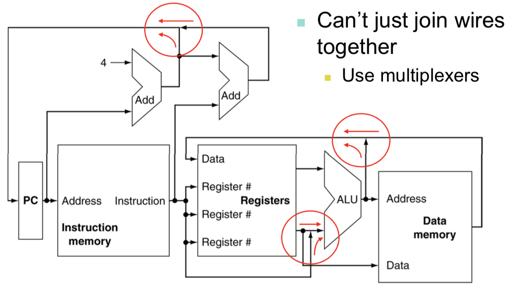
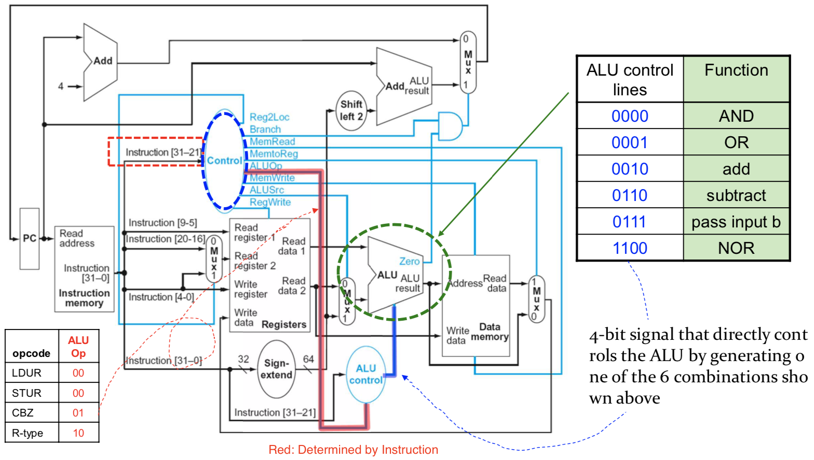
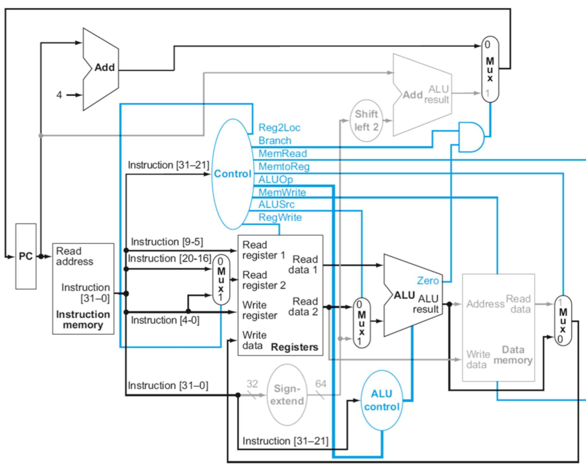
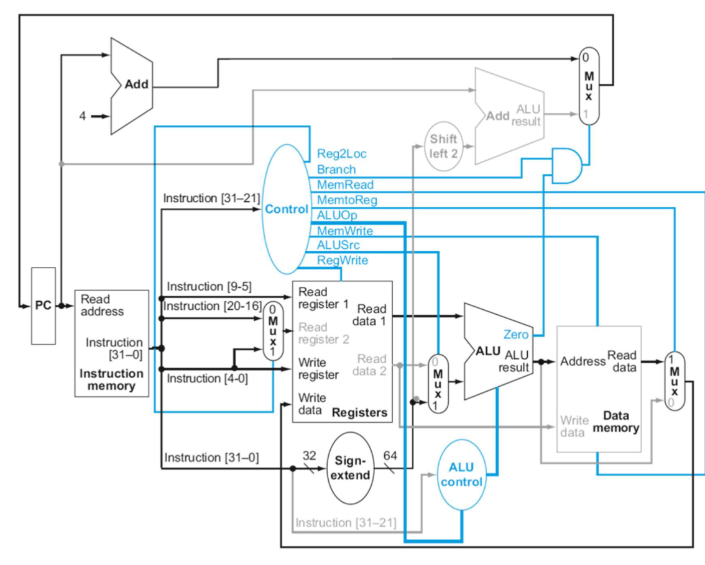
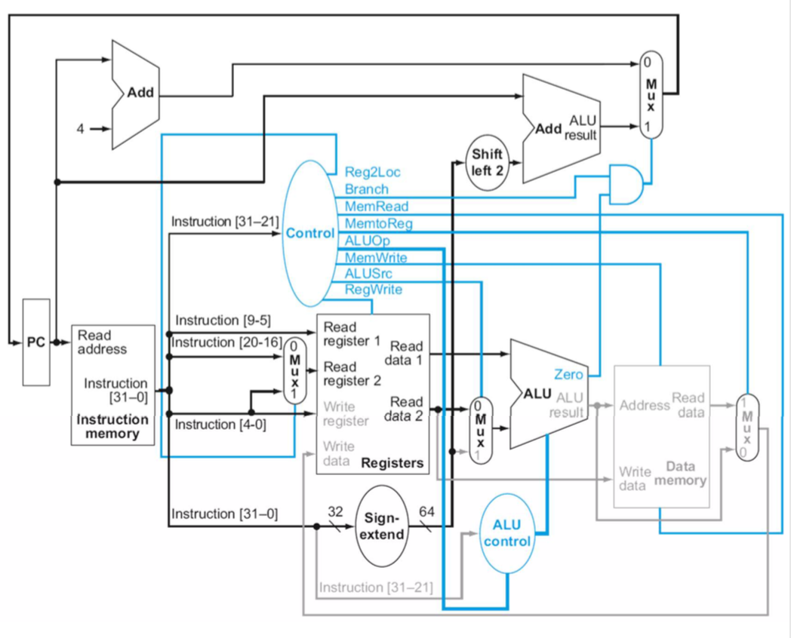
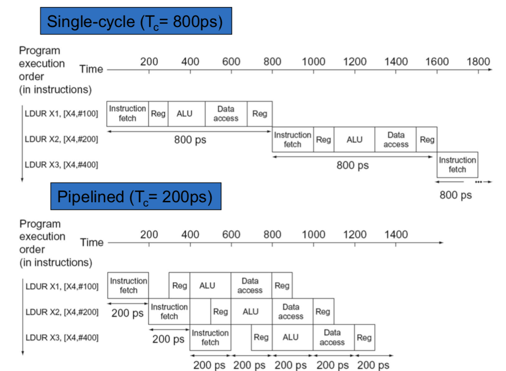
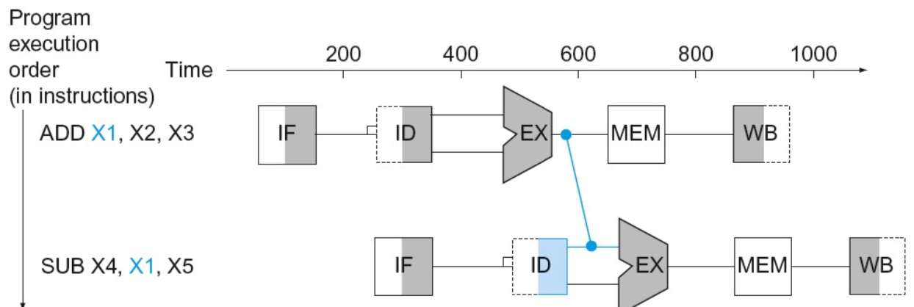
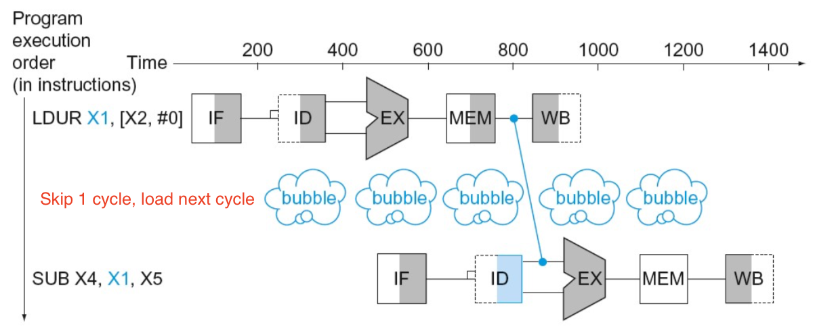
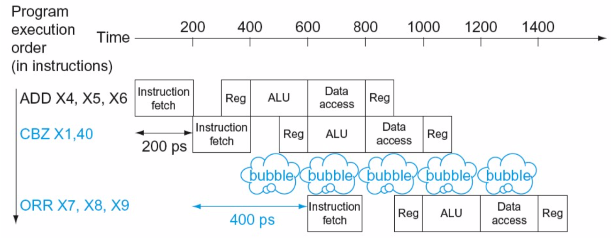

# Processor 2

**Multiplexers**

Collision → use multiplexor, 하나를 취해서 output으로 내보낸다 (Ex. Selector)

## **ALU Control**

---

### R-Type - ADD X1,X2,X3

- **instruction** fetched, **PC** incremented
- **Read** X2 X3 (← reg file),main **control unit** computes control lines
- **ALU** operates, generate ALU function (← opcode portion)
- **Write** result to register (X1)

### Load - LDUR X1, [X2, offset]

- **Instruction** fetch, **PC** increment
- **Read** reg X2
- **ALU sum** X2(← reg file) and offset(← Sign-extended)
- Sum(← ALU) **used as addr** for data memory
- **Write** data (← Memory) to **X1**

### CBZ - CBZ X1, offset

- **Instruction** fetch, **PC** increment
- **Read** X1 (← reg file)
- **ALU** pass data from reg file
PC added to offset(Sign-extended)
instruction **shift left 2**
result → **branch target addr**
- **Zero state** info (← ALU) used

### Single-Cycle

**Inefficient**
Clock Cycle must have **same length** for every instruction
Longest delay instruction (Critical path → load instruction) determines clock period

# Multi-Cycle design

---

## Pipelining

---

**Analogy**

- Overlapping execution, Same time but improve **throughput**

**LEGv8 Pipeline**

Five steps:

1. **IF** - **I**nstruction **F**etch
2. **ID** - **I**nstruction **D**ecode & register read
3. **EX** - Execute **operation** or calculate **addr**
4. **MEM** - Access memory operand (relatively longest)
5. **WB** - Write result Back

## **Performance**

---

One instruction into multi-cycle

Empty time at multi-cycle → donno what will be next

**Executing 3 instructions**

- Single-cycle: 800ps * 3 = 2400ps
- Pipeline: 200 + 200 + 1000 = 1400ps

improvement = 1.7x

**Executing 1,000,000 instructions**

- Single-cycle: 1,000,000 * 800ps = 800,000,000ps
- Pipeline: 1,000,000 * 200ps = 200,000,000ps

improvement = 4x → Time wasting between Instruction

**Speedup**

Why improvement = 4x not 5x?

- Not Balanced 
100ps for reg, 200ps for memory & ALU
Ideal case: **Balanced** → All stage spend same time
- Overhead
Pipeline hazard

If Balanced:

- Time between instructions(piped) = Time between instructions(non-piped)/num of Stages(5)

**Pipelining and ISA Design**

- Complex instruction (Don't now how much byte) → Can use whole stage to decode
- RISC → Designed for Modularization, pipelining

## Hazard

---

Situations prevent starting next instruction in next cycle

- Structure hazard → required resource is busy
- Data hazard → Wait prev instruction to its data R/W
- Control hazard → Decide control action depends on prev instructions

### Structure Hazards

Reason → 같은 시간대에 동시에 access, **One memory**

- Conflict for using resource
- Solution → **Separate** instruction/memories, **instruction fetch have to stall**

### Data Hazards

Access data prev instruction using

1. Stall cycle

**2. Fowarding (Bypassing)**

- Get data right after ALU (Don't wait for data stored in reg)
- Requires extra connection

**Local-Use Data Hazard → Fowarding X**

If value not computed yet → Stall

Ex. Load

**Code Scheduling to Avoid Stall**

> A = B + E; C = B + F;

Solution → Load first

### Control Hazards

- Fetching next instruction depends on branch outcome
- Next Instruction depends on prev instruction but no result yet

Solution → Wait until branch outcome determined before fetching next instruction

**Branch Prediction**

Stall for every Branch → Stall penalty unacceptable

- **Static branch prediction**
Don't know T/F but set T/F and don't stall → Wrong prediction possible
- **Dynamic branch prediction**
HW measures branch behavior (record recent history of branches)
Assure future behavior (trend, stall while re-fetching when wrong)