# Processor 3

## Pipeline registers

---

- Need registers between stages → hold info produced in prev cycle
- Save at end of prev Stage, get start of next Stage
- Flip-flop but register scale

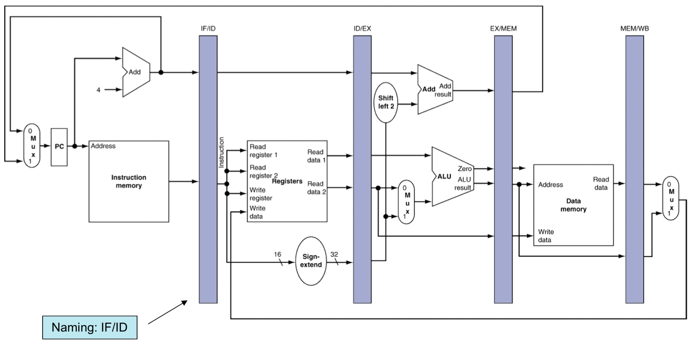

**IF for Load, store**

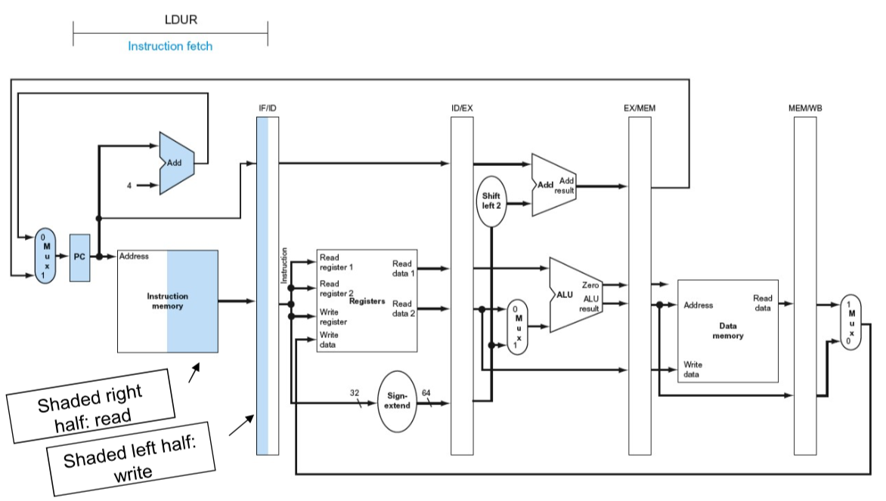

- I**nstruction read** from memory(using addr in PC), **place** IF/ID pipeline register
- PC + 4, 
incremented addr also saved in IF/ID pipeline register

**ID for Load, Store**

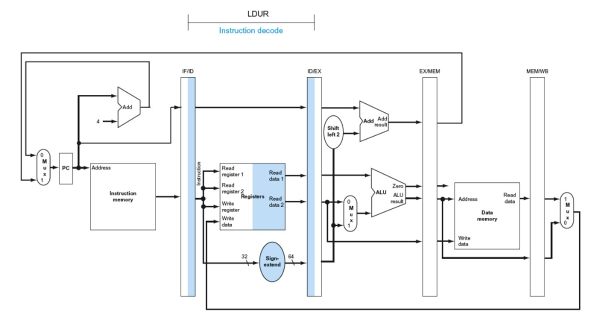

- Instruction portion (← IF/ID reg) supply Sign-extended
- Reg numbers read 2 regs
- Three values (Instruction, 2 numbers) stored in ID/EX reg

### For load

---

**EX for Load**

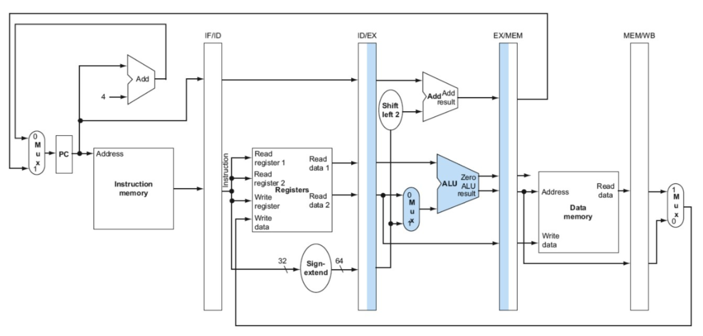

- Instruction read content(← register) & Sign-extended (← ID/EX )
- Add (ALU)
- Place sum (→ EX/MEM)

**MEM for Load**

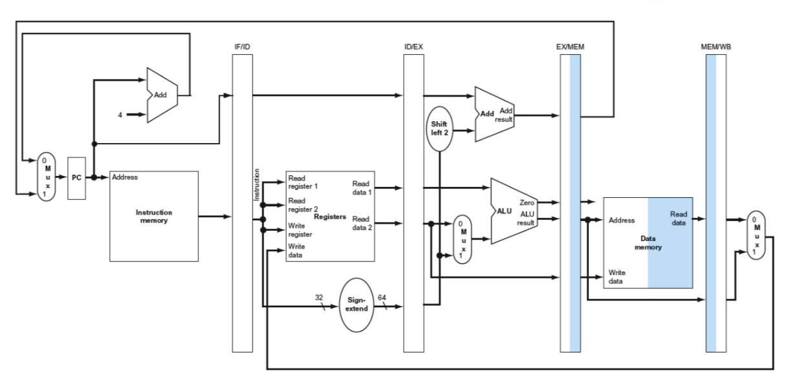

- Instruction read data memory (using addr from EX/MEM)
- Load data into MEM/WB

**WB for Load**

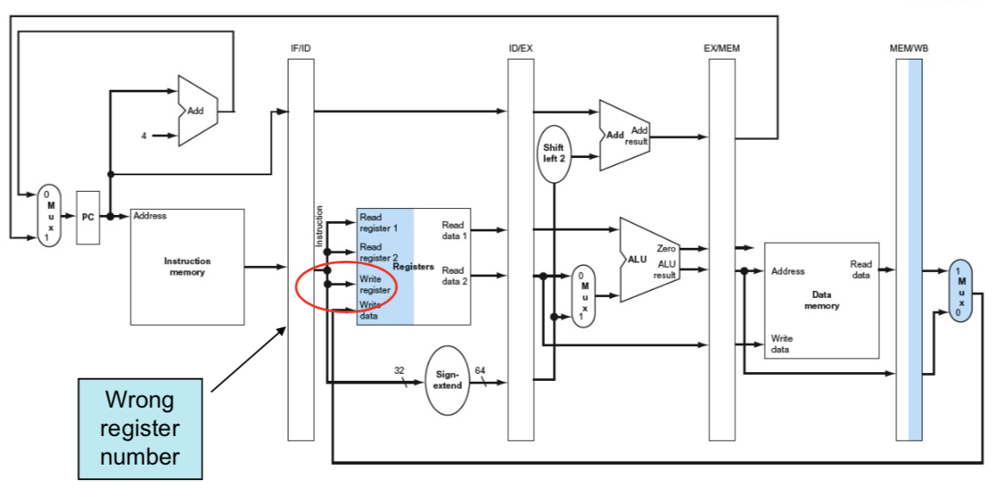

- Read data (← MEM/WB), write into register file
- 집어넣으려는 destination은 다음 instruciton의 것
- Write register number →

**Corrected Datapath for Load**

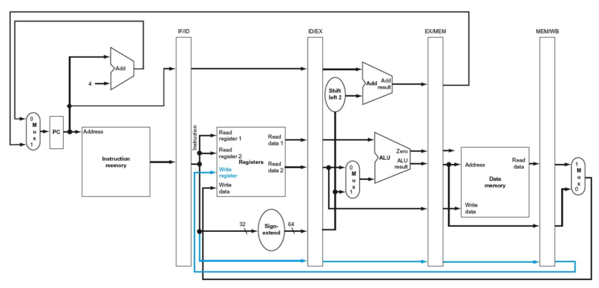

- To share pipelined datapath → preserve instruction read during IF stage (each pipeline register contain portion of instruciton needed for that & next stage)

**Hardware used for Load**

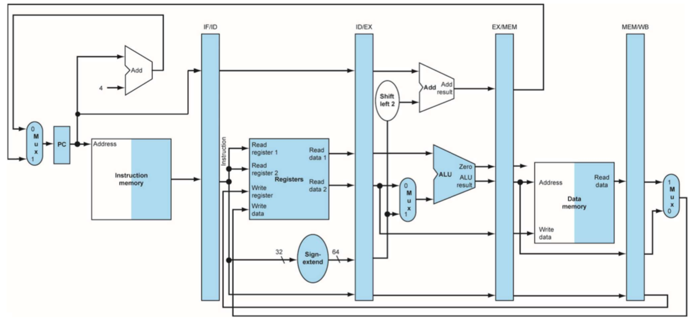

### For Store

---

**EX for Store**

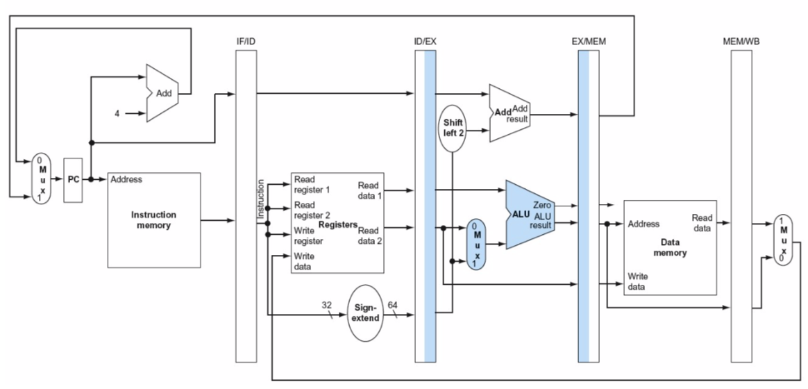

- Addr placed in EX/MEM

**MEM for Store**

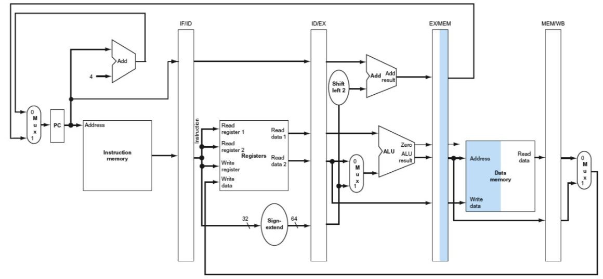

- Data written to memory

**WB for Store**

- Do NOTHING

## Multi-Cycle pipeline Diagram

---

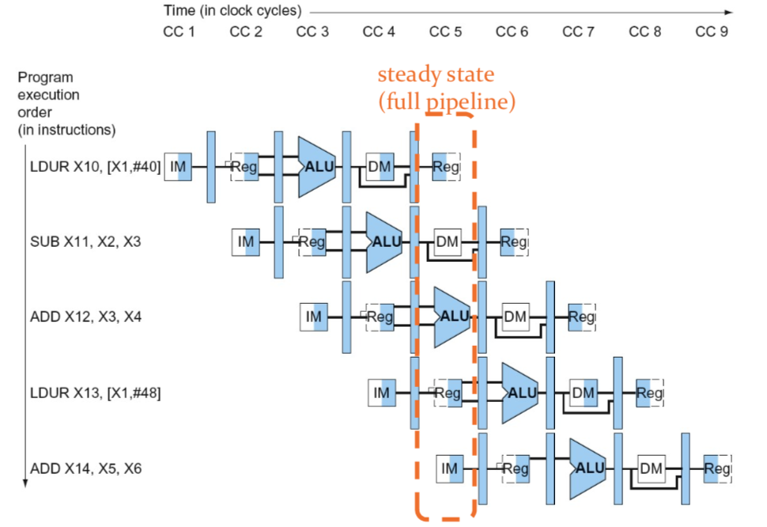

## Pipelined Control

---

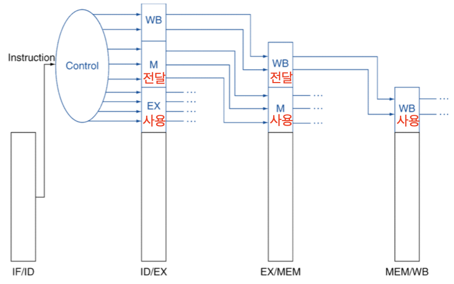

- Control signals derived from **instruction**
- Store signal needed for each stage, **send** unused signal to next pipeline register