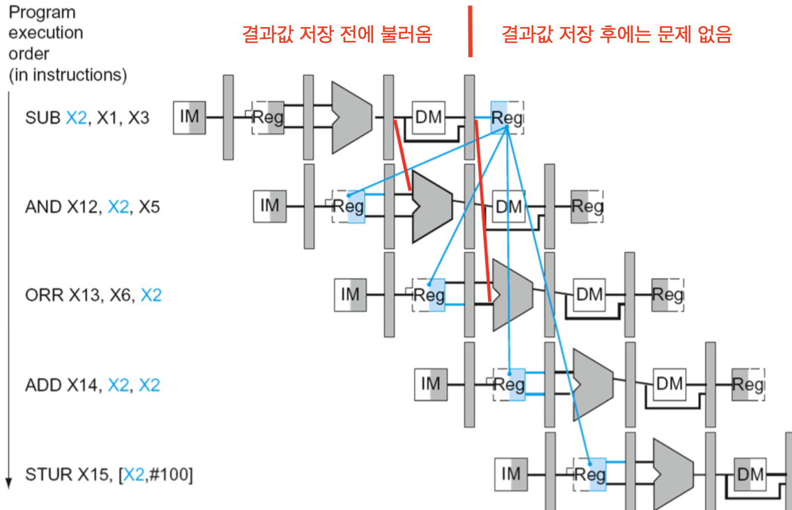
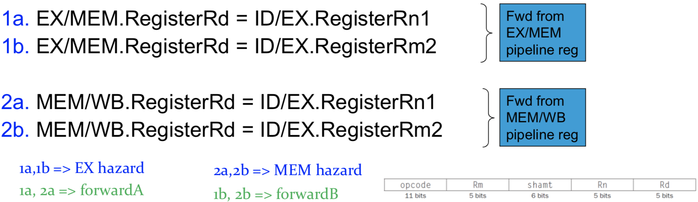
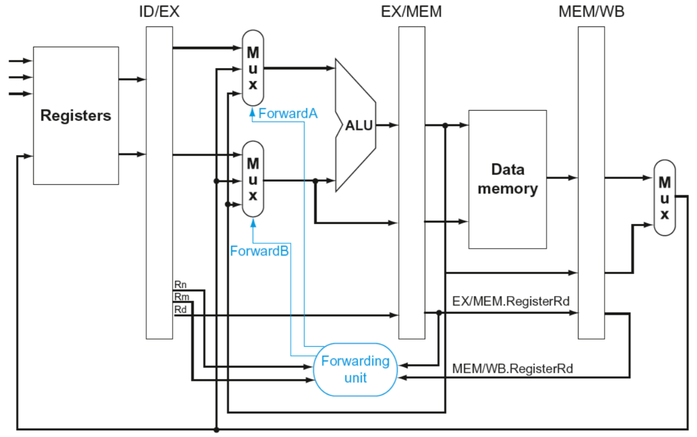
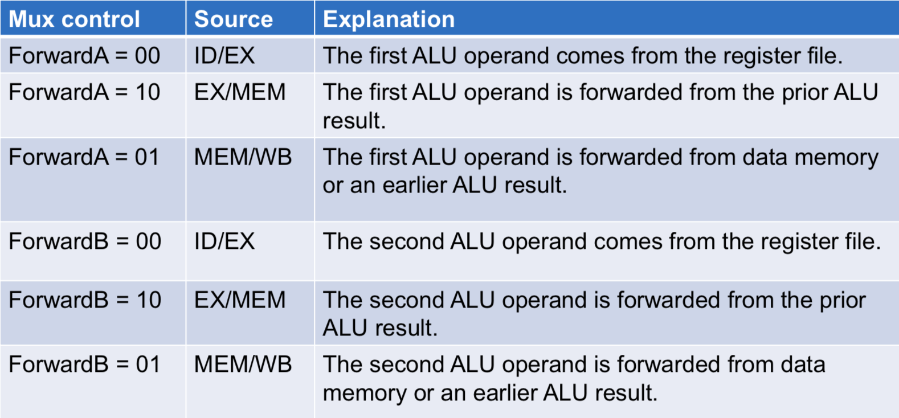
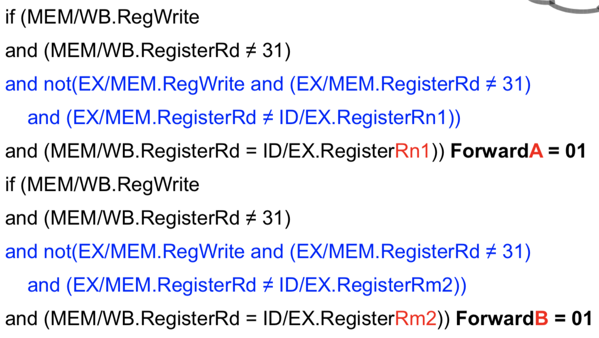
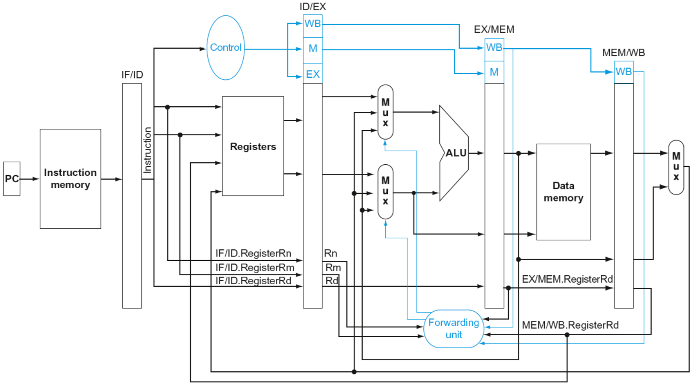
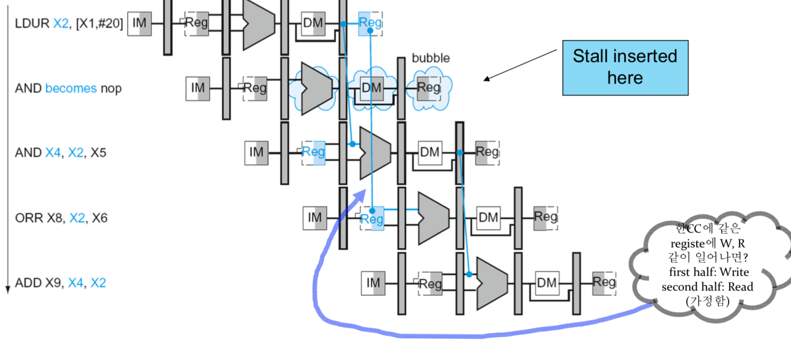
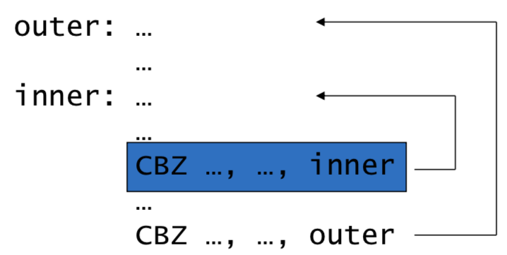
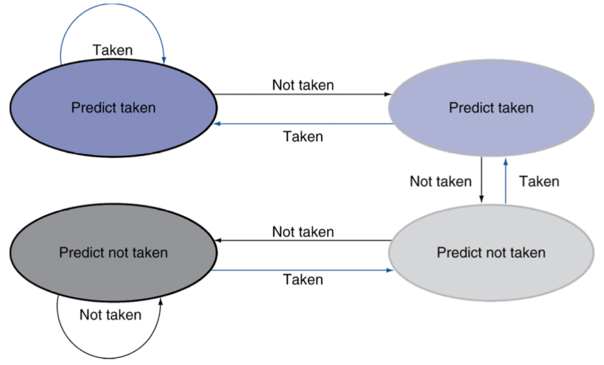

# Processor 4

### Hazards

- Structure Hazard → A required resource is busy
- Data Hazard → Need to wait for previous instruction to complete its data read/write
- Control Hazard → Deciding on control action depends on previous instruction

## Data Hazards

---

**In ALU** → next instruction have to wait till R/W ends

> SUB X2, X1,X3
AND X12,X2,X5
OR X13,X6,X2
ADD X14,X2,X2 
STUR X15,[X2,#100]

**Condition** → Using as opperand before register update (Same reg behind)

Data hazard **Detected** → **fowarding**

**Dependencies & Forwarding**

**Detecting the Need to Foward**

- Pass register numbers along pipeline
- ALU operand register number in EX stage are given by
- Data hazards when

- only if forwarding instruction will write to a register

**Forwarding Path**

### **Draw blue line**

**Forwarding Conditions**

## Double Data Hazard

---

> add X1,X1,X2
add X1,X1,X3
add X1,X1,X4

- Both hazard occur
Want to use **most recent** → Get **closer** one
- Revise MEM hazard condition
**Same destination** of current & next instruction → Forward EX/MEM

**Revised Forwarding Condition** → Forwarding from MEM/WB

- MEM Hazard

**Datapath with Forwarding**

### Load-Use Data Hazard

---

**Data Hazard Requiring a Stall**

Load instruction인 경우 데이터를 빼 오는게 메모리 끝부분이라 한클럭 뒤에있어서 미래에 일어날 일이기 때문에 어쩔 수 없이 쉬어야된다(Stall)

**Detection**

- Check when using instruction is **decoded** in **ID** stage 
→ hazard detection unit do this
- ALU **operand** register numbers in **ID** stage are given by
IF/ID.RegisterRn1, IF/ID.RegisterRm2
- Load-use hazard when
ID/EX.**MemRead** *→ MemRead: check if load by signal*
and ((ID/EX.RegisterRd = IF/ID.RegisterRn1) 
or (ID/EX.RegisterRd = IF/ID.RegisterRm1))

Detected → Stall & insert bubble

**Stall and Performance**

- Stall reduce performance but correct results
- Compiler can **arrange code to avoid** hazards and stalls → instruction scheduling

## Branch Hazards

---

**Reducing Branch Delay**

- Good predict
- Wrong predict → Predict **before MEM**

Add more ALU Unit to **Decode Stage** (more hardware)

**Example - Branch Taken**

Only at CBZ → Bubble

**Dynamic Branch Prediction**

한번이라도 돈게 있다면 명령어 입장에서 그 위치에 해당되는 브랜치가 어디로 갔는지에 대한 매핑 테이블이 남는다 → branch prediction table
taken/no taken에 대한 기록이 있으면 한번만 따라한다(one bit prediction)

**1-Bit Predictor: Shortcoming**

- Problem → result not constant
- Solution → Double check (2-Bit predictor)

**2-Bit Predictor**

Only change prediction on **two successive** mispredictions

**Calculating the Branch Target**