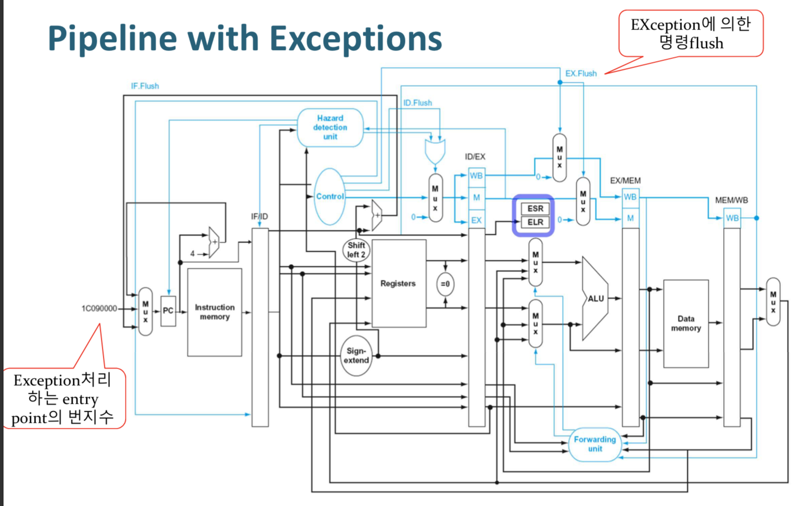
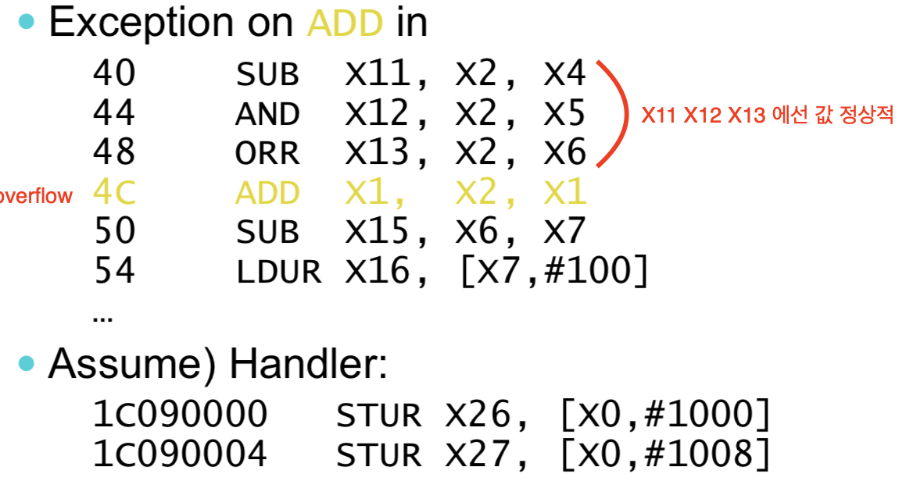
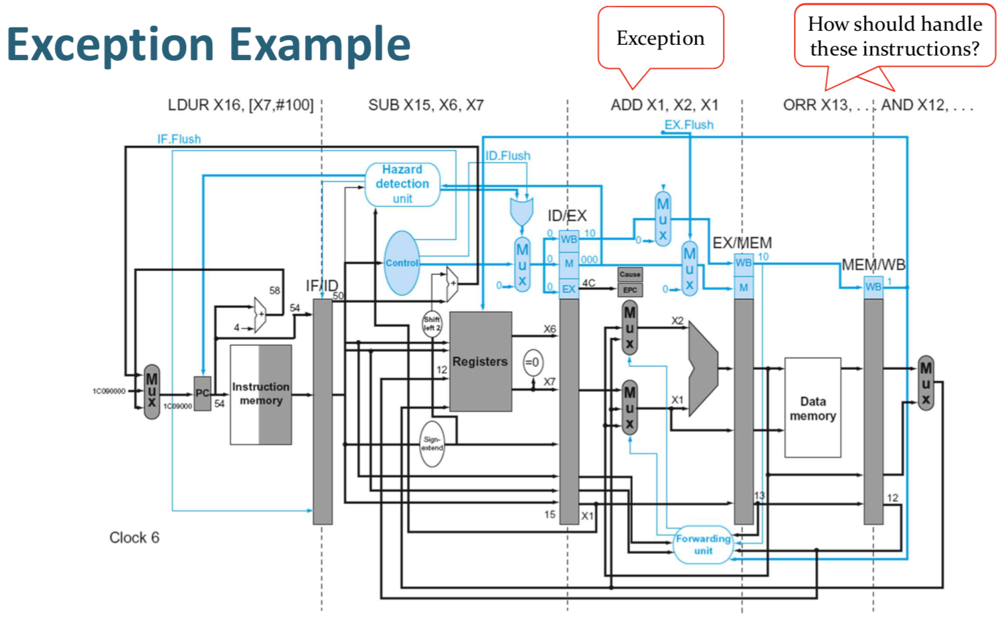

# Processor 5

## Exception & Interrupts

- Exception → Arises within the CPU (internal)
- Interrupt → externally caused (I/O controller)

### Handling Exceptions

---

Event  occur → Branch to event handling code

- Save PC of offending instruction → Save PC at Exception Link Register(ELR)
- ELR 값에 따라, 해당 program 실행 멈출지, 재시작할지 등 결정
- Save the cause of the exception

**Alternative Mechanism**

vector table base register → Jump to a single entry point

### Pipeline with Exceptions

---

**Exception Properties**

- Restartable exceptions
flush instruction, Return to instruction after handler
- PC saved in ELR register
Identify causing instruction, PC + 4 saved

**Example - ADD**

**Pipelined before exception → Update to register (Save)**

### Instruction-Level Parallelism (ILP)

---

To increase ILP

- Deeper pipeline (stage 더 잘게)
Less work per stage → shorter clock cycle
Problem → Overhead stall by dependency increase by more stage
- Multiple issue(명령어를 동시에 여러 개 실행하는 접근/ HW추가 & 구조 변경)